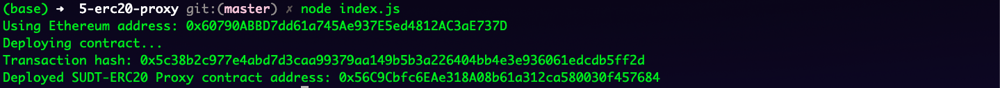
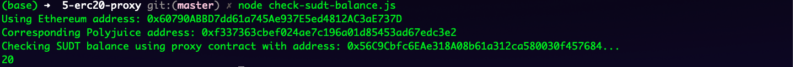

## Gitcoin: 5) Deploy The ERC20 Proxy Contract For The Deposited SUDT

## 1. Console output after deploying smart contract

## 2. Address of ERC20 Proxy Contract

0x56C9Cbfc6EAe318A08b61a312ca580030f457684

## 3. Console output after checking SUDT balance

## 4. The Ethereum address that was checked

0x60790ABBD7dd61a745Ae937E5ed4812AC3aE737D
